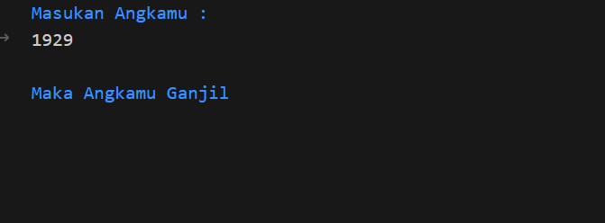

# Program Menentukan Bilangan Ganjil atau Genap

## Deskripsi
Program ini dibuat untuk menentukan apakah suatu bilangan yang dimasukkan oleh pengguna merupakan **bilangan ganjil** atau **bilangan genap**.  

## Cara Kerja Program
1. Program meminta pengguna memasukkan satu bilangan bulat.  
2. Program memeriksa sisa hasil bagi bilangan tersebut dengan 2 (bilangan % 2).  
3. Jika hasilnya 0, maka bilangan adalah **genap**.  
4. Jika hasilnya bukan 0, maka bilangan adalah **ganjil**.  
5. Hasilnya akan ditampilkan di layar.

## Contoh Output Program
