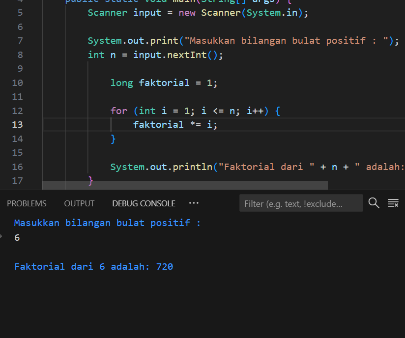

# Program Menghitung Faktorial Bilangan

## Deskripsi
Program ini dibuat untuk membantu dalam menghitung **faktorial** dari suatu bilangan bulat positif yang dimasukkan oleh pengguna.  

## Cara Kerja Program
1. Pengguna diminta memasukkan satu bilangan bulat positif.  
2. Program akan menghitung hasil faktorial dari bilangan tersebut dengan cara mengalikan bilangan dari 1 hingga bilangan itu sendiri.  
3. Hasil perhitungan faktorial akan ditampilkan di layar.  

## Rumus Faktorial
Jika `n` adalah bilangan bulat positif, maka:
n! = n × (n-1) × (n-2) × ... × 1
`5! = 5 × 4 × 3 × 2 × 1 = 120`

## Output Program
