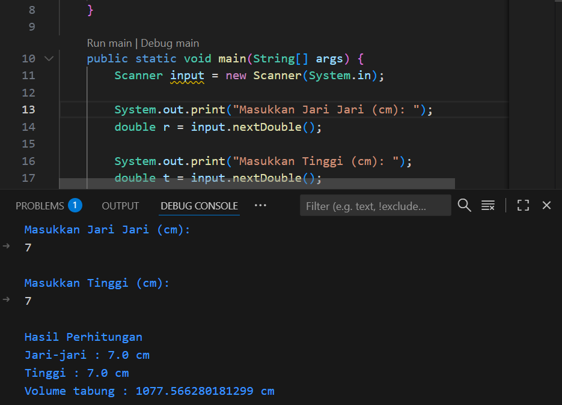

# Program Menghitung Volume Tabung (Dengan Fungsi dan Parameter)

## Deskripsi
Program ini dibuat untuk menghitung volume tabung menggunakan konsep fungsi (method) dengan parameter.  

## Rumus Volume Tabung
Volume tabung dapat dihitung dengan rumus:
V = π × r² × t

## Cara Kerja Program
1. Pengguna diminta memasukkan jari-jari dan tinggi tabung.  
2. Nilai tersebut dikirim ke dalam fungsi `hitungVolume()` sebagai `parameter`.  
3. Fungsi akan menghitung volume menggunakan rumus di atas.  
4. Hasil perhitungan volume ditampilkan di layar.

## Catatan
- Fungsi main tempat input dan pemanggilan fungsi  
- Fungsi `hitungVolume(double jari, double tinggi)`fungsi dengan parameter untuk menghitung volume tabung  
- Nilai `return` dari fungsi digunakan untuk menampilkan hasil di main

# Output Program
