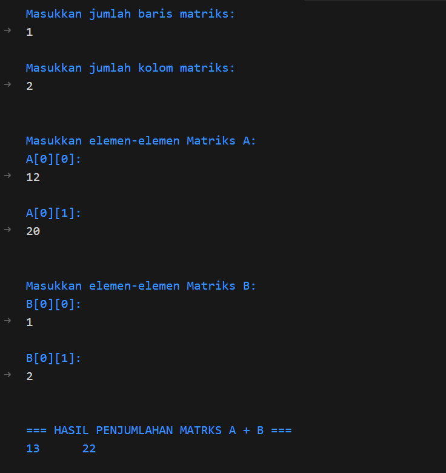

# Program Penjumlahan Dua Matriks

## Deskripsi
Program ini dibuat untuk melakukan penjumlahan dua buah matriks berukuran sama.  
Setiap elemen dari kedua matriks akan dijumlahkan sesuai posisi baris dan kolomnya, kemudian hasilnya ditampilkan dalam bentuk matriks baru.

## Cara Kerja Program
1. Pengguna memasukkan ukuran matriks (jumlah baris dan kolom).  
2. Program meminta pengguna mengisi nilai untuk **Matriks A** dan **Matriks B**.  
3. Program menjumlahkan elemen-elemen yang memiliki posisi yang sama.  
4. Hasil penjumlahan ditampilkan dalam bentuk **Matriks C (hasil penjumlahan)**.

## Rumus Penjumlahan Matriks
Jika Matriks A dan Matriks B berukuran `1 x 1`, maka hasilnya adalah:
C[i][j] = A[i][j] + B[i][j]

## Output Program

